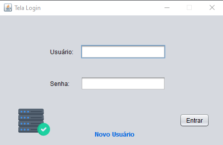
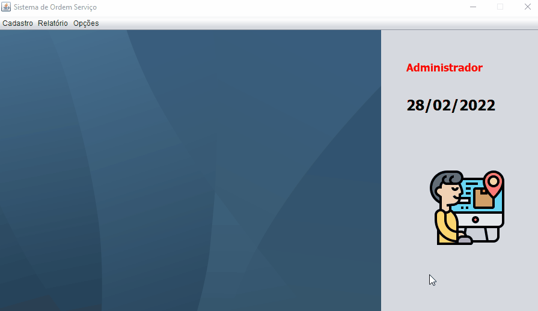

# gestaoServico

Sistema para Controle de Ordem de Serviço desenvolvido para uma Assistência Técnica de Microcomputadores, notebooks e periféricos.
 

<ul>
    <li>Tela Login </li>
     
    
</ul>

<ul>
    <li>Tela Principal</li>
     
    
</ul>

<h1>Alterações em relação ao projeto original</h1>

<ul>
    <li>Ícones na barra de menu e nos itens de menu.</li>
    <li>Utiliza a arquitetura de software <b>MVC</b>(Model-View-Controller)</li>
    <li>O usuário pode adicionar um novo usuário, mas não pode ver o relatório dos serviços e não pode realizar alterações nos outros usuários.</li>
    <li>Utiliza a API LocalDate.</li>
    <li>Vai consultar um usuário utilizando o JoptionPane na TelaUsuário.</li>
    <li>Quando o administrador ou usuário fizerem uma consulta na ordem de serviço o botão de consulta não vai ser desabilitado</li>
</ul>

<h1>Projeto Original</h1>

https://github.com/professorjosedeassis/infox

<h1>Bibliotecas e Frameworks</h1>

<ul>
    <li>atxy2k</li>
    <li>driver MySQL
</li>
    <li>rs2xml
</li>
    <li>iReport-5.6.0</li>
</ul>

